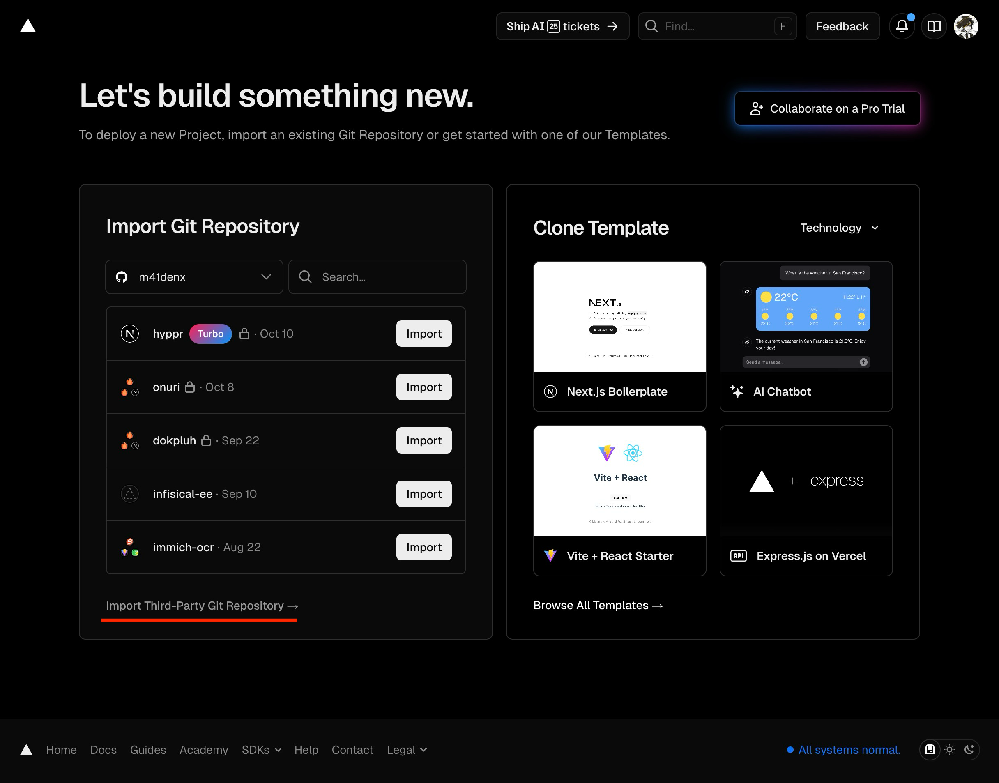
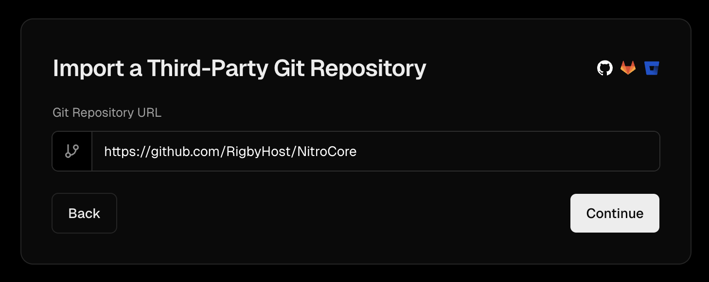
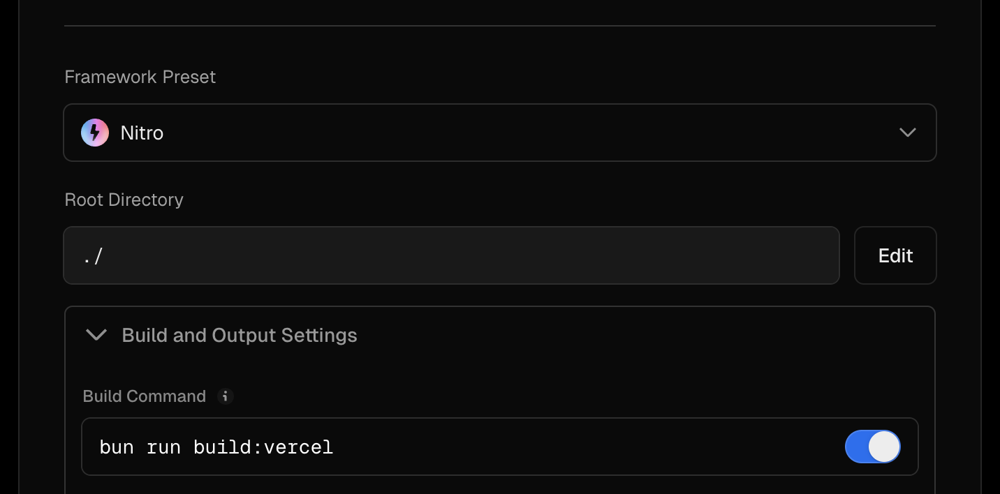
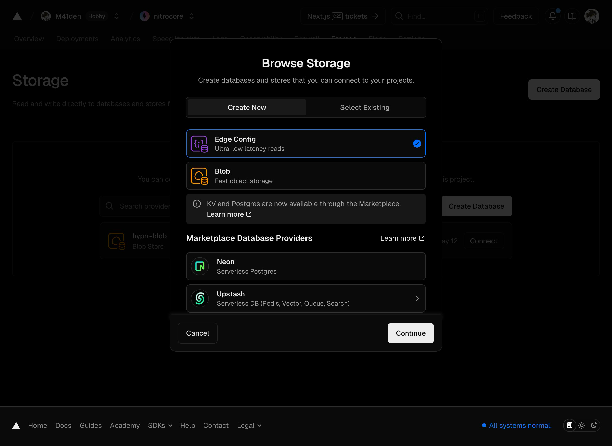

# Запуск NitroCore на ▲ [Vercel](https://vercel.com)

NitroCore без проблем запускается на большинстве облачных провайдеров, включая Vercel.

Данное руководство предназначено для тех, кто ни разу в жизни Vercel не видел. Если вы знаете что делаете, то TLDR: просто замените команду сборки на `bun run build:vercel` 

1. Зарегистрируйте аккаунт на Vercel

2. Нажмите **Add New... → Project**

3. Выберите **Import Third-Party Git Repository →**
   

4. Укажите URL данного репозитория и нажмите **Continue**
   

5. Дальше измените **Build Command** в Build and Output Settings на `bun run build:vercel`, нажмите **Deploy**.

   Если Vercel жалуется на `Project names can be up to 100 characters long and must be lowercase...`, то просто переименуйте проект, чтобы в нем не было заглавных букв
   

6. Перейдите в раздел **Storage** проекта, нажмите **Create Database** и выберите **Edge Config** — там будет храниться конфиг вашего GDPS
   

7. 