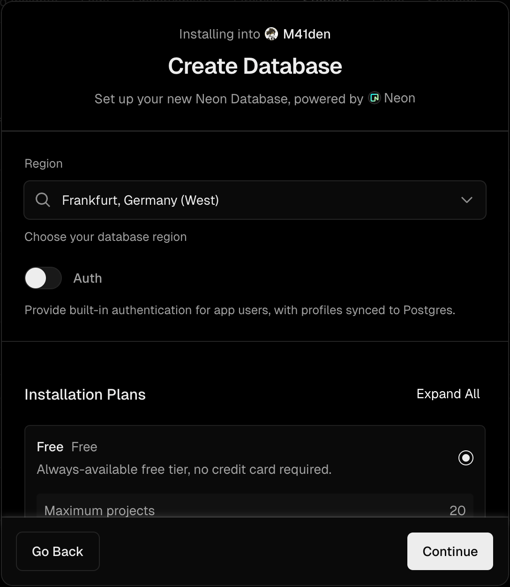

# Запуск NitroCore на ▲ [Vercel](https://vercel.com)

NitroCore без проблем запускается на большинстве облачных провайдеров, включая Vercel.

Данное руководство предназначено для тех, кто ни разу в жизни Vercel не видел. Если вы знаете что делаете, то TLDR: просто замените команду сборки на `bun run build:vercel` 

Плюс данного подхода в том, что все ваши ресурсы хостятся бесплатно, а из-за сборки исходников на стороне Vercel у вас всегда рабочий сервер на последней версии без необходимости что-то вручную обновлять!

## Подготовка проекта

1. Зарегистрируйте аккаунт на Vercel

2. Нажмите **Add New... → Project**

3. Выберите **Import Third-Party Git Repository →**
   

4. Укажите URL данного репозитория и нажмите **Continue**
   

5. Дальше измените **Build Command** в Build and Output Settings на `bun run build:vercel`, нажмите **Deploy**.

   Если Vercel жалуется на `Project names can be up to 100 characters long and must be lowercase...`, то просто переименуйте проект, чтобы в нем не было заглавных букв
   

6. Перейдите в раздел **Storage** проекта, нажмите **Create Database** и выберите **Edge Config** — там будет храниться конфиг вашего GDPS
   

7. Для ключа 0000 вставьте конфигурацию из [example-config.json](./example-config.json), нажимаем **Save** и подтверждаем
   

8. Теперь создадим **Blob** хранилище сохранений игроков, **не забывая выбрать регион ближайший к вам и игрокам**
   

9. Для **Blob** хранилища ничего не нужно настраивать, но не забывайте об ограничениях бесплатного тарифа: максимум 1 гигабайт сохранений
   

10. Теперь создадим БД для вашего сервера, воспользовавшись либо **Postgres Neon**, либо **Supabase**
    

## Настройка Serverless Postgres БД

Ниже указан туториал для Postgres Neon и Supabase

|                        Postgres Neon                         |                           Supabase                           |
| :----------------------------------------------------------: | :----------------------------------------------------------: |
| Выберите ближайший регион и бесплатный тариф | Выберите ближайший регион и бесплатный тариф  |
| После создания будет доступна БД, для Neon дополнительные настройки не нужны  | После создания будет доступна БД, для Supabase дополнительные настройки не нужны  |

Теперь перейдите в раздел Deployments, нажмите на последнюю сборку и нажмите Redeploy, чтобы ядро перезапустилось и залило скелет БД на ваш сервер

## На каком домене работает мой сервер?

Переходим в **Settings → Domains** и видим наш домен. Соответственно в нашем случае базовая ссылка до БД - `nitrocore-five.vercel.app/0000/db` (31 символ, что меньше чем 34)

Если же вы хотите добавить свой домен, то нажимаете Add Domain и следуете инструкциям

